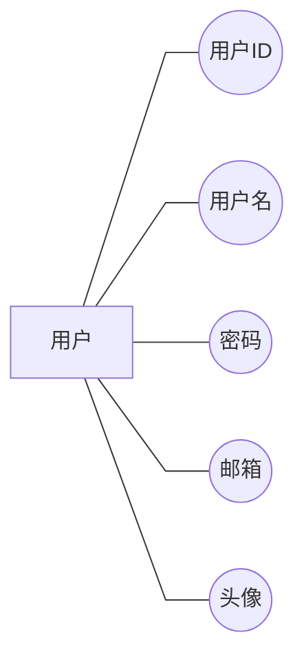
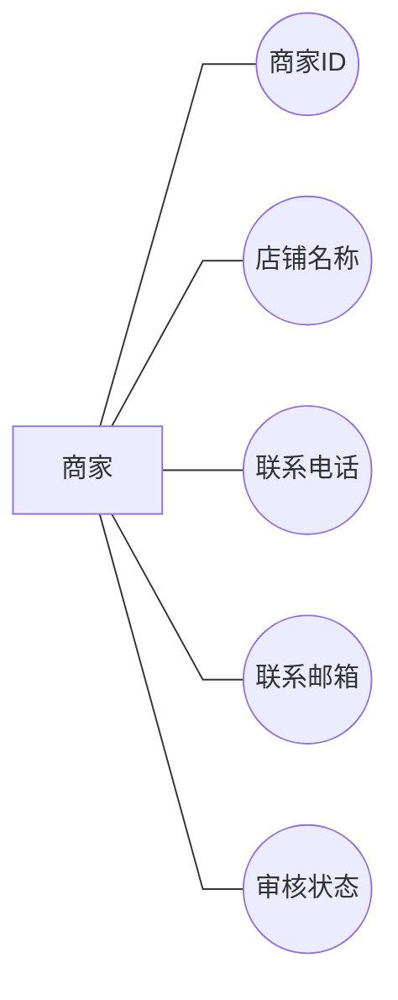
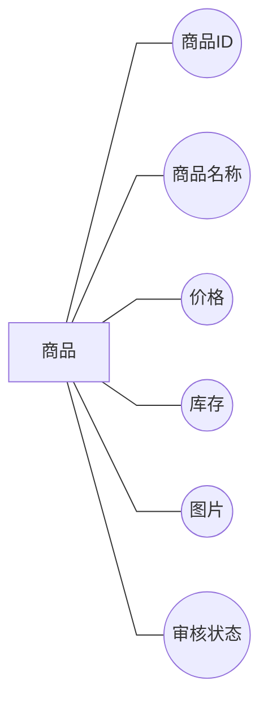
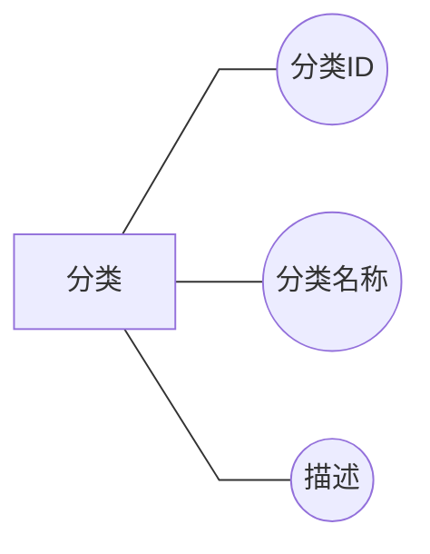
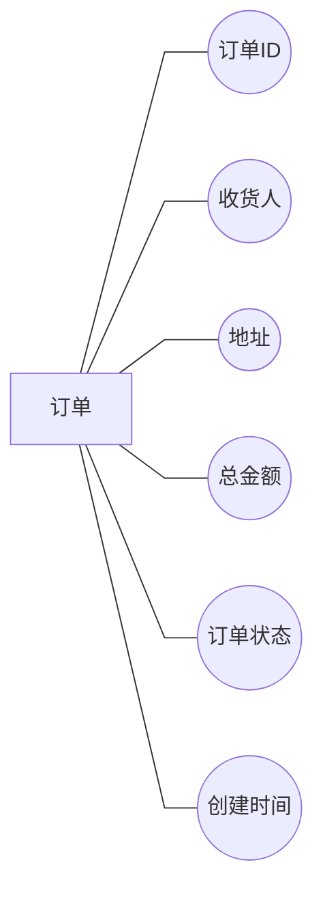
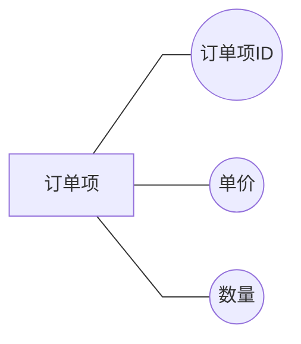
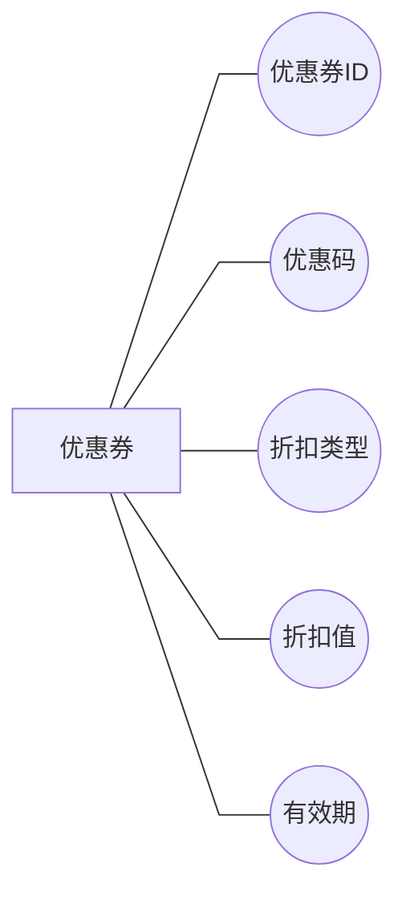
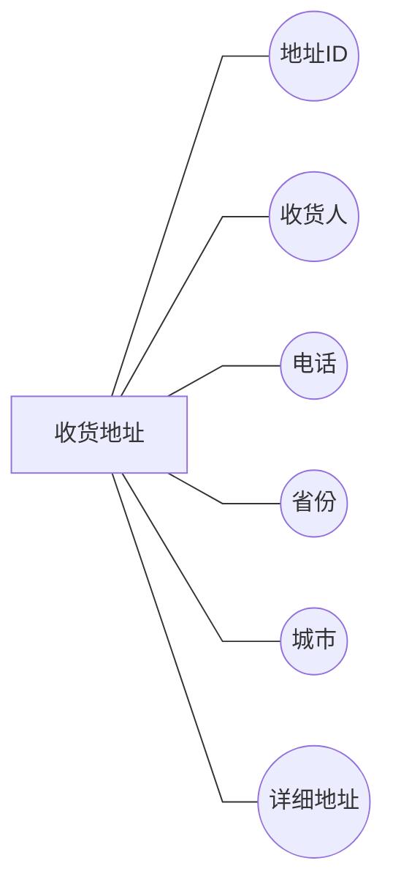
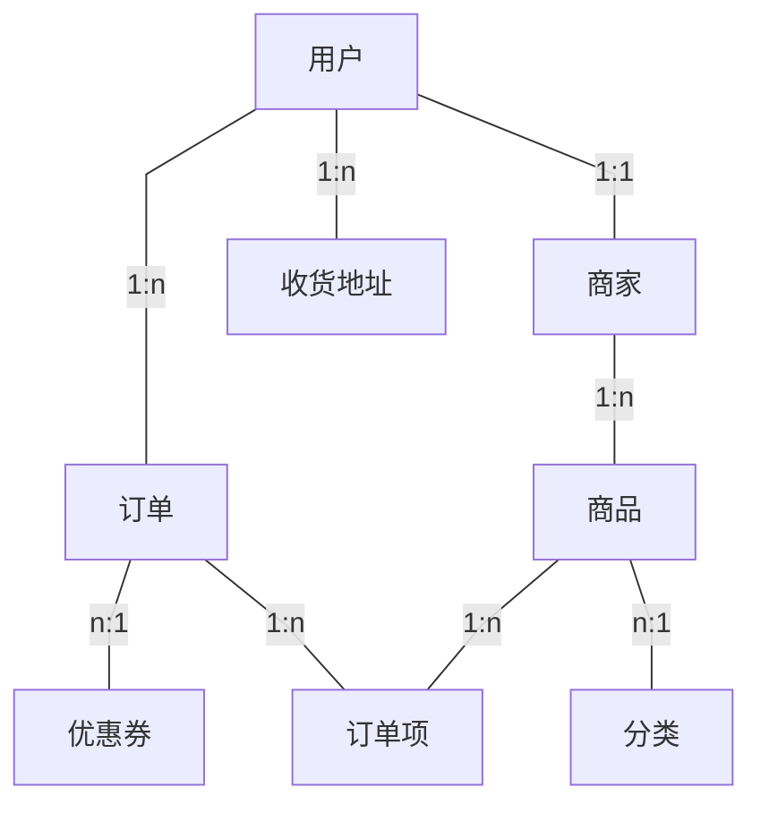

# 电商系统 E-R 图

## 图例说明
- **矩形**：实体
- **椭圆**：属性
- **菱形**：关系
- **直线**：连接线
- **1:n** 一对多，**m:n** 多对多

---

## 一、用户实体



---

## 二、商家实体



---

## 三、商品实体



---

## 四、分类实体



---

## 五、订单实体



---

## 六、订单项实体



---

## 七、优惠券实体



---

## 八、收货地址实体



---

## 九、实体关系总图



---

## 十、详细关系图（ASCII版本，可复制到论文）

### 10.1 系统整体关系

```
┌────────┐    1:n    ┌────────┐    1:n    ┌────────┐
│  用户  │───────────│  订单  │───────────│ 订单项 │
└────────┘           └────────┘           └────────┘
    │                    │                    │
    │ 1:1                │ n:1                │ n:1
    │                    │                    │
    ▼                    ▼                    ▼
┌────────┐          ┌────────┐          ┌────────┐
│  商家  │          │ 优惠券 │          │  商品  │
└────────┘          └────────┘          └────────┘
    │                                        │
    │ 1:n                                    │ n:1
    │                                        │
    ▼                                        ▼
┌────────┐                              ┌────────┐
│  商品  │                              │  分类  │
└────────┘                              └────────┘
```

### 10.2 用户相关关系

```
                        ┌────────┐
                        │  用户  │
                        └────┬───┘
             ┌───────────────┼───────────────┐
             │               │               │
          1:n│            1:1│            1:n│
             │               │               │
             ▼               ▼               ▼
        ┌────────┐     ┌────────┐     ┌────────┐
        │  订单  │     │  商家  │     │收货地址│
        └────────┘     └────────┘     └────────┘
```

### 10.3 商品相关关系

```
                        ┌────────┐
                        │  商品  │
                        └────┬───┘
             ┌───────────────┼───────────────┐
             │               │               │
           n:1│            1:n│            1:n│
             │               │               │
             ▼               ▼               ▼
        ┌────────┐     ┌────────┐     ┌────────┐
        │  分类  │     │ 订单项 │     │  评价  │
        └────────┘     └────────┘     └────────┘
```

### 10.4 订单相关关系

```
                        ┌────────┐
                        │  订单  │
                        └────┬───┘
             ┌───────────────┼───────────────┐
             │               │               │
           1:n│            n:1│              │
             │               │               │
             ▼               ▼               ▼
        ┌────────┐     ┌────────┐     ┌────────┐
        │ 订单项 │     │ 优惠券 │     │  用户  │
        └────────┘     └────────┘     └────────┘
             │
           n:1
             │
             ▼
        ┌────────┐
        │  商品  │
        └────────┘
```

---

## 十一、实体关系对照表

| 实体A | 关系 | 实体B | 基数 | 说明 |
|-------|------|-------|------|------|
| 用户 | 下单 | 订单 | 1:n | 一个用户可下多个订单 |
| 用户 | 拥有 | 收货地址 | 1:n | 一个用户可有多个地址 |
| 用户 | 收藏 | 商品 | m:n | 通过心愿单实现 |
| 用户 | 评价 | 商品 | m:n | 通过评价表实现 |
| 用户 | 申请 | 商家 | 1:1 | 一个用户对应一个商家 |
| 商家 | 提供 | 商品 | 1:n | 一个商家可提供多商品 |
| 商品 | 属于 | 分类 | n:1 | 多商品属于一个分类 |
| 商品 | 包含于 | 订单 | m:n | 通过订单项实现 |
| 订单 | 使用 | 优惠券 | n:1 | 多订单可用同一优惠券 |

---

## 十二、Visio 绘制指南

### 步骤一：绘制实体
1. 插入 → 形状 → 矩形
2. 填充色设为白色，边框为黑色
3. 在矩形内输入实体名称

### 步骤二：绘制属性
1. 插入 → 形状 → 椭圆
2. 填充色设为白色，边框为黑色
3. 主键属性加下划线

### 步骤三：绘制关系
1. 插入 → 形状 → 菱形
2. 填充色设为白色，边框为黑色
3. 在菱形内输入关系名称

### 步骤四：连接
1. 使用直线连接各形状
2. 在连接线旁标注基数（1、n、m）

---

## 十三、使用 Typora 渲染

将本文档复制到 Typora 中，即可自动渲染 Mermaid 图表。

如需导出图片：
1. 右键点击图表
2. 选择"导出为PNG"或"导出为SVG"
3. 插入到论文中
