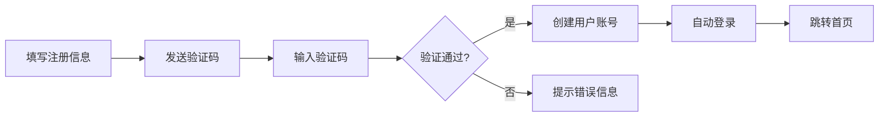
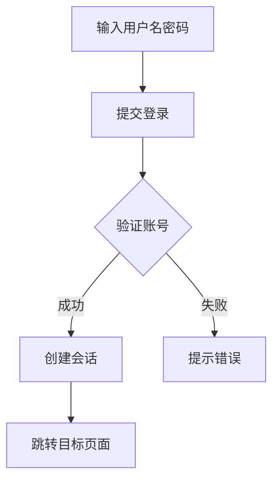
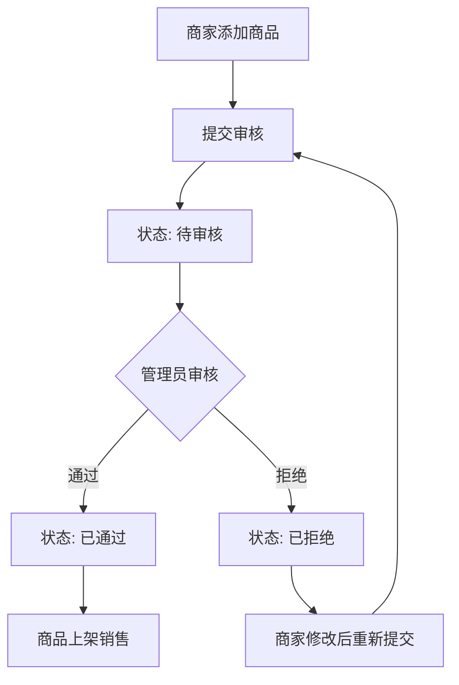
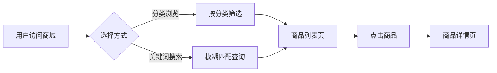
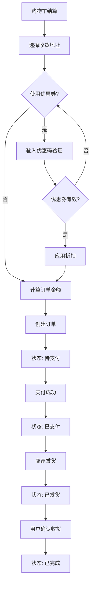
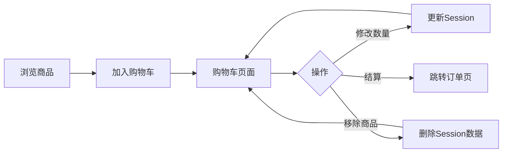
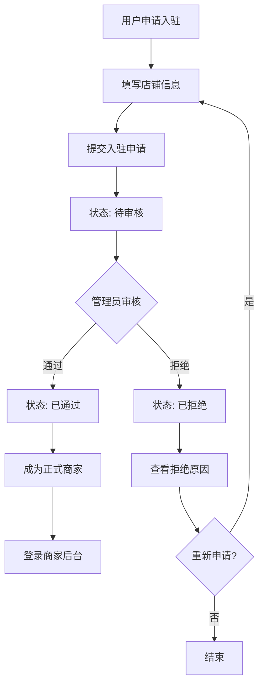
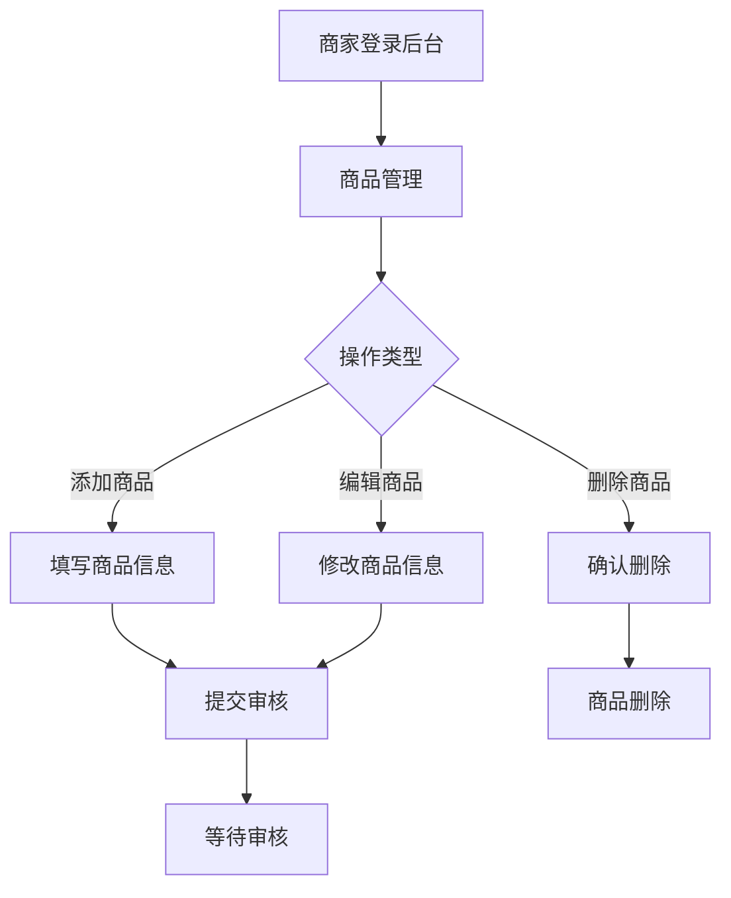
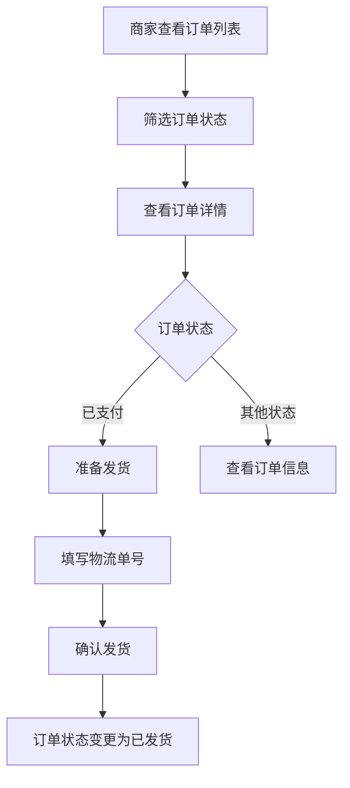
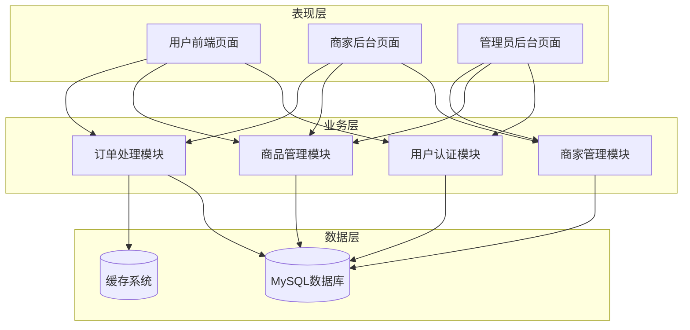

# 系统功能设计与实现

---

## 第一节 用户模块

### 1.1 功能概述

用户模块是电商平台的基础模块，主要负责用户账号的管理与认证。该模块实现了用户注册、登录、个人信息管理及收货地址管理等功能。系统采用Django框架内置的User模型作为基础，通过Profile模型扩展存储用户头像、手机号、生日等附加信息。用户注册时需通过邮箱验证码验证身份，验证码存储于系统缓存中，有效期为五分钟，确保注册流程的安全性。密码采用Django内置的PBKDF2算法进行加密存储，保障用户账号安全。登录功能支持用户名密码认证，登录成功后可进入个人中心管理个人信息、查看订单记录及管理收货地址。收货地址支持添加、编辑、删除及设置默认地址，满足用户多地址管理的需求。

### 1.2 用户注册流程



### 1.3 用户登录流程



### 1.4 核心实现

用户注册视图实现邮箱验证与用户创建：

```python
def register(request):
    if request.method == 'POST':
        form = RegisterForm(request.POST)
        if form.is_valid():
            user = User.objects.create_user(
                username=form.cleaned_data['username'],
                email=form.cleaned_data['email'],
                password=form.cleaned_data['password']
            )
            login(request, user)
            return redirect('main:index')
    return render(request, 'registration/register.html', {'form': form})
```

---

## 第二节 商品模块

### 2.1 功能概述

商品模块负责商品的分类管理、展示、搜索及评价功能。系统支持多级商品分类，每个分类包含名称、别名及描述信息。商品信息包括名称、价格、库存、图片、描述等基本属性，同时关联所属分类与商家。商品需经过审核流程方可上架销售，审核状态包括待审核、已通过、已拒绝三种，确保平台商品质量。用户可通过分类导航或关键词搜索查找商品，搜索支持商品名称与描述的模糊匹配。商品详情页展示商品完整信息、用户评价及相关推荐。评价功能仅对已购买用户开放，评价内容包括一至五分评分与文字评论，为其他用户提供购物参考。

### 2.2 商品审核流程



### 2.3 商品展示流程



### 2.4 核心实现

商品列表视图根据审核状态过滤商品：

```python
def product_list(request, category_slug=None):
    products = Product.objects.filter(
        available=True,
        review_status='approved'
    ).select_related('category')

    if category_slug:
        category = get_object_or_404(Category, slug=category_slug)
        products = products.filter(category=category)

    return render(request, 'goods/product_list.html', {'products': products})
```

---

## 第三节 购物车与订单模块

### 3.1 功能概述

购物车模块基于Session机制实现，用户无需登录即可使用购物车功能。购物车数据以字典形式存储于Session中，键为商品ID，值为商品数量，避免频繁的数据库操作。用户可在购物车中修改商品数量或移除商品，系统实时计算购物车总价与商品总数量。订单模块处理订单的创建、支付、发货及完成等全生命周期管理。用户提交订单时需选择收货地址，可选择使用优惠券。订单创建后状态为待支付，支付成功后变为已支付，商家发货后变为已发货，用户确认收货后变为已完成。系统支持订单取消功能，取消后自动恢复库存。

### 3.2 订单处理流程



### 3.3 购物车流程



### 3.4 核心实现

购物车添加商品视图：

```python
def cart_add(request, product_id):
    cart = request.session.get('cart', {})
    cart[str(product_id)] = cart.get(str(product_id), 0) + 1
    request.session['cart'] = cart
    return JsonResponse({'success': True, 'cart_total': len(cart)})
```

订单创建视图：

```python
@login_required
def checkout(request):
    if request.method == 'POST':
        order = Order.objects.create(
            user=request.user,
            first_name=request.POST['first_name'],
            total_amount=calculate_total(request)
        )
        for item in get_cart_items(request):
            OrderItem.objects.create(
                order=order,
                product=item.product,
                price=item.product.price,
                quantity=item.quantity
            )
        return redirect('orders:order_detail', order.id)
```

---

## 第四节 商家模块

### 4.1 功能概述

商家模块是本次系统新增的核心功能模块，实现了商家入驻、商品管理、订单处理及销售统计等完整功能。用户可申请成为商家，填写店铺名称、联系方式等信息后提交审核，管理员审核通过后即可成为正式商家。商家登录后可进入专属后台管理系统，进行商品的添加、编辑、删除操作。商家添加的商品需提交管理员审核，审核通过后方可上架销售。商家可查看包含自己商品的订单，并进行发货处理。销售统计功能提供按时间范围查询的销售额、订单数统计及商品销量排行，帮助商家了解经营状况。店铺设置功能支持商家修改店铺名称、联系方式、店铺简介等基本信息。

### 4.2 商家入驻流程



### 4.3 商家商品管理流程



### 4.4 商家订单处理流程



### 4.5 核心实现

商家注册视图实现：

```python
def merchant_register(request):
    if request.method == 'POST':
        form = MerchantRegisterForm(request.POST)
        if form.is_valid():
            user = User.objects.create_user(
                username=form.cleaned_data['username'],
                password=form.cleaned_data['password']
            )
            Merchant.objects.create(
                user=user,
                shop_name=form.cleaned_data['shop_name'],
                status='pending'
            )
            return redirect('merchant:login')
    return render(request, 'merchant/register.html', {'form': form})
```

商家权限验证装饰器：

```python
def merchant_required(view_func):
    def wrapper(request, *args, **kwargs):
        if not hasattr(request.user, 'merchant'):
            return redirect('merchant:login')
        if not request.user.merchant.is_approved:
            return redirect('merchant:pending')
        return view_func(request, *args, **kwargs)
    return wrapper
```

商家商品列表视图：

```python
@merchant_required
def product_list(request):
    merchant = request.user.merchant
    products = Product.objects.filter(merchant=merchant)
    return render(request, 'merchant/products/list.html', {'products': products})
```

---

## 第五节 系统技术架构

### 5.1 整体架构说明

本系统采用经典的B/S架构，基于Django框架进行开发。系统整体分为表现层、业务层、数据层三个层次。表现层负责用户界面的展示与交互，包括用户前端页面、商家后台页面及管理员后台页面。业务层实现核心业务逻辑的处理，包括用户认证、商品管理、订单处理、商家管理等模块。数据层负责数据的持久化存储与访问，采用MySQL关系型数据库存储结构化数据，使用缓存系统存储临时数据如验证码、购物车等。系统采用MVT设计模式，模型负责数据定义与操作，视图处理业务逻辑，模板负责页面渲染，实现各层次间的解耦。

### 5.2 系统架构图



---

## 附录：论文写作说明

### 各模块建议篇幅

| 模块 | 流程图数量 | 代码片段数量 | 建议页数 |
|------|-----------|-------------|---------|
| 用户模块 | 2个 | 1个 | 2-3页 |
| 商品模块 | 2个 | 1个 | 2-3页 |
| 购物车+订单模块 | 2个 | 2个 | 3-4页 |
| 商家模块 | 3个 | 3个 | 4-5页 |
| 技术架构 | 1个 | 0个 | 1-2页 |

### 使用说明

1. 将本文档复制到Typora中可查看完整效果
2. 流程图可右键导出为PNG或SVG格式
3. 代码可直接复制到论文中，建议使用等宽字体
4. 文字部分可根据实际需要适当调整
