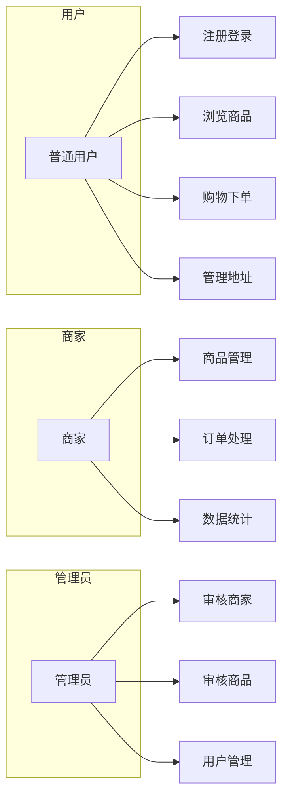

# 本科毕业论文编写指南

## 论文整体结构

```
封面
摘要
目录

第一章 绪论
第二章 相关技术介绍
第三章 系统需求分析
第四章 系统设计
第五章 系统实现
第六章 系统测试
第七章 总结与展望

参考文献
致谢
附录（可选）
```

---

## 编写顺序建议

### 推荐编写顺序

```
第一步：第三章 需求分析  →  第四章 系统设计
第二步：第五章 系统实现
第三步：第六章 系统测试
第四步：第二章 相关技术介绍
第五步：第一章 绪论
第六步：第七章 总结与展望
第七步：摘要
最后：目录、参考文献、致谢
```

**原因**：
- 需求分析和系统设计是核心，先写可以理清思路
- 实现章节基于设计章节，自然衔接
- 测试验证实现效果
- 技术介绍和绪论可后续补充完善
- 摘要需概括全文，最后写最准确

---

## 各章节详细内容

### 第一章 绪论（约1500字）

#### 1.1 研究背景
- 电子商务发展现状
- 传统电商模式的问题
- 商家入驻审核机制的必要性

#### 1.2 研究意义
- 理论意义：丰富电商平台设计研究
- 实践意义：为中小电商平台提供参考

#### 1.3 国内外研究现状
- 国外电商平台发展（亚马逊、eBay等）
- 国内电商平台发展（淘宝、京东等）
- 现有研究的不足

#### 1.4 研究内容与方法
- 本文主要研究内容
- 采用的研究方法

#### 1.5 论文组织结构
- 各章节简要介绍

---

### 第二章 相关技术介绍（约2000字）

#### 2.1 Django框架
- Django简介与特点
- MVT设计模式
- Django核心组件

#### 2.2 数据库技术
- MySQL数据库介绍
- 数据库设计原则

#### 2.3 前端技术
- HTML5与CSS3
- JavaScript与Ajax
- Tailwind CSS框架

#### 2.4 开发环境
- Python版本
- 开发工具
- 运行环境

---

### 第三章 系统需求分析（约2500字）

#### 3.1 可行性分析
- 技术可行性
- 经济可行性
- 操作可行性

#### 3.2 功能需求分析

##### 3.2.1 用户端功能需求
- 用户注册登录
- 商品浏览与搜索
- 购物车管理
- 订单管理
- 个人中心

##### 3.2.2 商家端功能需求
- 商家入驻申请
- 商品管理
- 订单处理
- 销售统计

##### 3.2.3 管理端功能需求
- 用户管理
- 商家审核
- 商品审核
- 订单管理

#### 3.3 非功能需求分析
- 性能需求
- 安全需求
- 可维护性需求

#### 3.4 用例图



---

### 第四章 系统设计（约3000字）

#### 4.1 系统总体设计

##### 4.1.1 系统架构设计
- B/S架构介绍
- 三层架构设计

##### 4.1.2 功能模块设计
- 功能模块划分图
- 各模块职责说明

#### 4.2 数据库设计

##### 4.2.1 概念结构设计
- E-R图设计
- 实体关系说明

##### 4.2.2 逻辑结构设计
- 数据库表结构
- 表字段说明

#### 4.3 详细设计

##### 4.3.1 用户模块设计
- 注册登录流程
- 个人中心设计

##### 4.3.2 商品模块设计
- 商品分类设计
- 商品审核流程

##### 4.3.3 订单模块设计
- 购物车设计
- 订单状态流转

##### 4.3.4 商家模块设计
- 入驻流程设计
- 商品管理设计

---

### 第五章 系统实现（约3500字）★重点章节

#### 5.1 开发环境搭建
- Python环境配置
- Django项目创建
- 数据库配置

#### 5.2 用户模块实现
- 功能说明（200字）
- 流程图
- 核心代码
- 实现要点

#### 5.3 商品模块实现
- 功能说明（200字）
- 流程图
- 核心代码
- 实现要点

#### 5.4 购物车与订单模块实现
- 功能说明（200字）
- 流程图
- 核心代码
- 实现要点

#### 5.5 商家模块实现
- 功能说明（200字）
- 流程图
- 核心代码
- 实现要点

#### 5.6 管理后台实现
- 后台功能介绍
- 审核功能实现

---

### 第六章 系统测试（约1500字）

#### 6.1 测试环境
- 硬件环境
- 软件环境

#### 6.2 功能测试

| 测试项 | 测试内容 | 预期结果 | 实际结果 |
|--------|---------|---------|---------|
| 用户注册 | 填写正确信息注册 | 注册成功 | 通过 |
| 用户登录 | 输入正确账号密码 | 登录成功 | 通过 |
| 商品搜索 | 输入关键词搜索 | 显示匹配商品 | 通过 |
| 加入购物车 | 点击加入购物车 | 商品添加成功 | 通过 |
| 提交订单 | 选择地址提交 | 订单创建成功 | 通过 |
| 商家入驻 | 提交入驻申请 | 等待审核 | 通过 |
| 商品审核 | 管理员审核商品 | 状态变更正确 | 通过 |

#### 6.3 性能测试
- 页面响应时间
- 并发访问测试

#### 6.4 兼容性测试
- 浏览器兼容性
- 设备兼容性

#### 6.5 测试结论

---

### 第七章 总结与展望（约800字）

#### 7.1 工作总结
- 完成的主要工作
- 实现的核心功能
- 创新点

#### 7.2 存在的不足
- 功能方面的不足
- 性能方面的不足

#### 7.3 未来展望
- 功能扩展方向
- 技术优化方向

---

### 摘要（约300字）

**中文摘要模板：**

本文设计并实现了一个基于Django框架的电子商务平台，系统包含用户端、商家端和管理端三个子系统。用户端实现了用户注册登录、商品浏览、购物车管理、订单处理等功能；商家端实现了商家入驻、商品管理、订单处理、销售统计等功能；管理端实现了用户管理、商家审核、商品审核等功能。

系统采用B/S架构，基于Django框架开发，使用MySQL数据库存储数据，前端采用Tailwind CSS框架构建响应式界面。核心功能包括：基于Session的购物车实现、商品审核流程、商家入驻审核机制等。

经过测试验证，系统功能完整、运行稳定、界面友好，达到了预期的设计目标，具有一定的实用价值。

**关键词：** 电子商务；Django；商家入驻；商品审核

---

## 编写时间规划

| 阶段 | 内容 | 建议时间 |
|------|------|---------|
| 第一阶段 | 第三章需求分析 + 第四章系统设计 | 3-4天 |
| 第二阶段 | 第五章系统实现 | 4-5天 |
| 第三阶段 | 第六章系统测试 | 1-2天 |
| 第四阶段 | 第二章技术介绍 | 1天 |
| 第五阶段 | 第一章绪论 | 1天 |
| 第六阶段 | 第七章总结 + 摘要 | 0.5天 |
| 第七阶段 | 目录、参考文献、致谢 | 0.5天 |
| 最后阶段 | 修改完善、格式调整 | 1-2天 |

**总计：约12-15天**

---

## 参考文献格式示例

```
[1] 张三. 基于Django的电子商务系统设计与实现[D]. 北京: 北京大学, 2023.
[2] 李四. Python Web开发实战[M]. 北京: 人民邮电出版社, 2022.
[3] Django Software Foundation. Django Documentation[EB/OL]. https://docs.djangoproject.com/, 2024.
[4] 王五. 电子商务平台架构设计研究[J]. 计算机应用, 2023, 43(5): 123-128.
```

---

## 注意事项

1. **先写核心章节**：第三章到第六章是主体，先完成这些
2. **图文并茂**：每个核心功能配流程图
3. **代码适量**：只展示核心代码，每个功能10-15行
4. **统一格式**：字体、字号、行距等按学校要求
5. **多检查**：写完后检查错别字、格式问题
6. **备份**：定期备份论文文件
